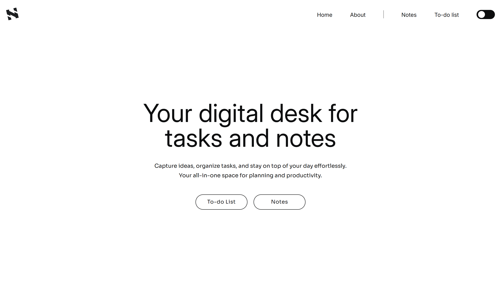

# Noto 📝

**Noto** is a sleek and intuitive web application for managing notes and to-do lists. Easily create, edit, mark, and pin tasks to stay organized efficiently.

  

## 🚀 Features
- 📝 **Create & Edit Notes** – Quickly jot down ideas or to-dos.
- 📌 **Pin Important Notes** – Keep crucial tasks at the top.
- ✅ **Mark as Done** – Stay on track by checking off completed tasks.
- 🎨 **Minimal & Clean UI** – Designed for focus and productivity.

## 🛠️ Installation
1. Clone the repository:
2. Navigate to the project folder:
3. Install dependencies:
4. Start the development server:
   ```sh
   git clone https://github.com/yourusername/noto.git
   cd noto
   npm install
   ```


## 📷 Noto dashboard view
  

---

Made with ❤️ by **Dawn Izach**

